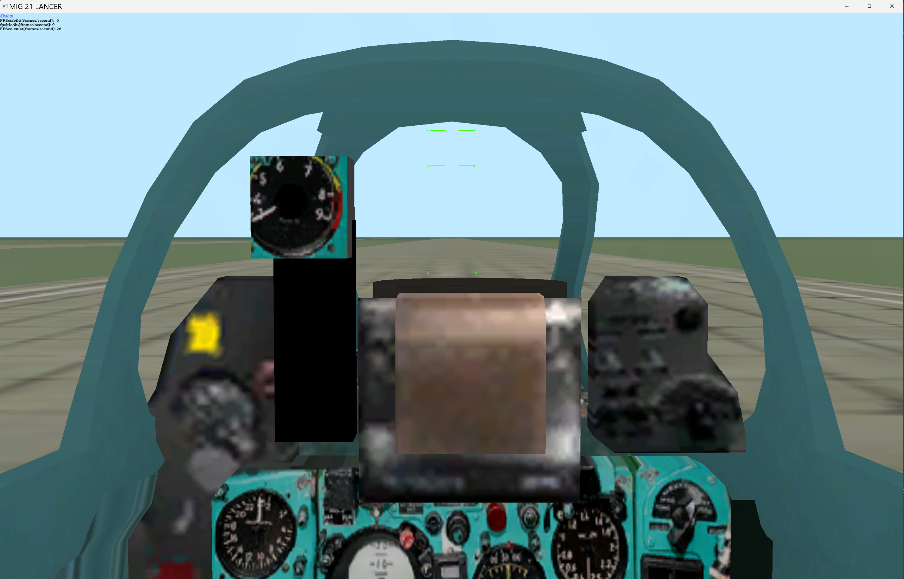
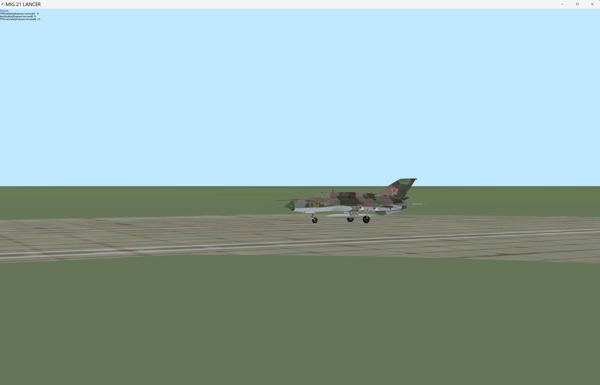

## MiG 21 Flight Simulator with DirectX 8.0

Demo project for flight simulation of the legendary `MiG 21` military jet. It's from a long time ago when I was just starting with C++ and 3D graphics. Although the code and graphics look rudimentary, the flight dynamics is quite realistic. The project also includes a simplistic but robust collision detection system.      

### Screenshots

<video width="480" height="280" controls>
  <source src="./Screenshots/mig21_fly.mp4" type="video/mp4">
</video>